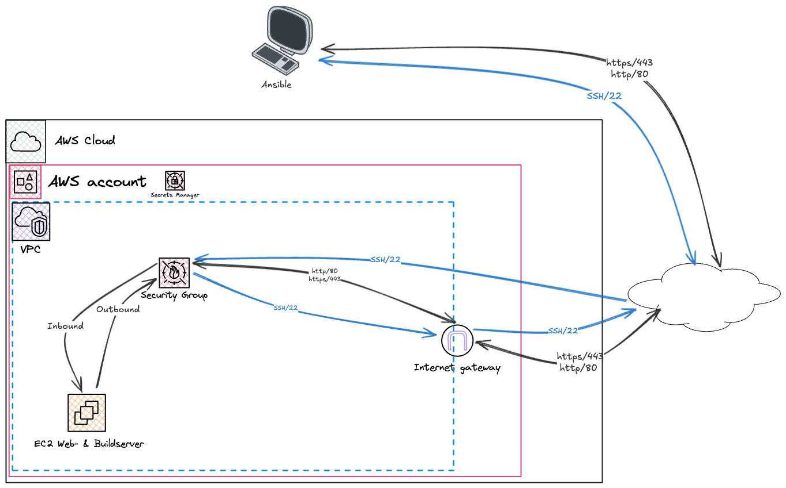

# NGINX Reverse Proxy with SSL

## Task description



## Precondition

For more details about the preconditions please see the [SETUP.md](SETUP.md).

## Steps to initially build and deploy the webapp

1. Provision EC2 Instance
    ```bash
    terraform plan -out=plan.out
    terraform apply plan.out
    ```
2. Create/Update the hostname (in Ansible `{{ domain_name }}`) with the EC2 Instance' public IP address at your public DNS provider. For instance, [no-ip.com](https://www.no-ip.com).

3. Update Ansible inventories `ansible/inventories/demo/hosts`
    ```bash
    [buildserver]
    ec2-35-158-140-221.eu-central-1.compute.amazonaws.com -> new EC2 Public DNS

    [webserver]
    ec2-35-158-140-221.eu-central-1.compute.amazonaws.com -> new EC2 Public DNS
    ```
    > [!TIP]
    > The command `terraform output` displays the defined output variables.  
    > Example:
    > ```bash
    > ec2_instance_id_webserver = "i-0a6a6ce2956060b99"
    > ec2_instance_state_webserver = "running"
    > ec2_instance_webserver = "ec2-35-158-140-221.eu-central-1.compute.amazonaws.com"
    > ec2_instance_webserver_private_ip = "172.31.32.110"
    > ec2_instance_webserver_public_ip = "35.158.140.221"
    > ec2_key_aws_ssm_webserver = "arn:aws:secretsmanager:eu-central-1:723952339148:secret:ec2/webserver/private-key-7Uxopv"
    > ```
4. Build new docker image version
    ```bash
    ansible-playbook -i inventories/demo \
      -u ansible build.yaml \
      --extra-vars='{"repository": "dockersamples/linux_tweet_app", "branch": "master", "image_name": "localhost/webapp", "image_tag": "1.0", "tag_image_latest": true}'
    ```
5. Deploy the web application
    ```bash
    ansible-playbook -i inventories/demo \
      -u ansible deploy-webapp.yaml \
      --extra-vars='{"image_name": "localhost/webapp", "image_tag": "1.0"}'
    ```
> [!TIP]
> Optionally, step 4 and 5 can be combined by running the "build and deploy"
> ```bash
> ansible-playbook -i inventories/demo \
>   -u ansible build-deploy-webapp.yaml \
>   --extra-vars='{"repository": "dockersamples/linux_tweet_app", "branch": "master", "image_name": "localhost/webapp", "image_tag": "1.0", "tag_image_latest": true}'
> ```
 
6. Optional: Connect to EC2 Instance  
For further details about how to connect to an EC2 Instance please see the respective [documentation](SETUP.md#connect-to-ec2-instance)

7. Access the deployed web application under [https://app-rgitoh.zapto.org](https://app-rgitoh.zapto.org).
    > [!NOTE]
    > The web application is also available with port 80 ([http://app-rgitoh.zapto.org](http://app-rgitoh.zapto.org)). However, nginx is configured to automatically redirect any http request to https:
    > ```bash
    > server {
    >   listen 80;
    >   server_name app-rgitoh.zapto.org;
    >   return 301 https://$host$request_uri;
    > }
    >
    > server {
    >   listen 443 ssl;
    >   server_name app-rgitoh.zapto.org;
    >
    >   ssl_certificate /etc/letsencrypt/live/app-rgitoh.zapto.org/fullchain.pem;
    >   ssl_certificate_key /etc/letsencrypt/live/app-rgitoh.zapto.org/privkey.pem;
    >
    >   location / {
    >       proxy_pass http://tweet-app:80;
    >       proxy_set_header Host $host;
    >       proxy_set_header X-Real-IP $remote_addr;
    >       proxy_set_header X-Forwarded-For $proxy_add_x_forwarded_for;
    >       proxy_set_header X-Forwarded-Proto $scheme;
    >   }
    > }
    > ```

## Steps to decomission the whole infrastructure

1. Decommission EC2 instance
    ```bash
    terraform plan -destroy -out=plan.out
    terraform apply plan.out
    ```
 
## Ansible Playbooks
    
### Inventory

```bash
[buildserver]
ec2-3-75-232-191.eu-central-1.compute.amazonaws.com

[webserver]
ec2-3-75-232-191.eu-central-1.compute.amazonaws.com

[buildserver:vars]
ansible_user=admin
ansible_ssh_private_key_file=/tmp/ansible/ec2_key.pem
ansible_python_interpreter=/usr/bin/python

[webserver:vars]
ansible_user=admin
ansible_ssh_private_key_file=/tmp/ansible/ec2_key.pem
ansible_python_interpreter=/usr/bin/python
```

### Playbooks

The following Ansible playbooks have been created:
- build.yaml
- deploy-webapp.yaml
- build-deploy-webapp.yaml
- check-certificate.yaml

#### Build only

Builds only the the required docker image.

```yaml
---
- hosts: localhost
  gather_facts: false
  roles:
    - role: get_private_key_from_aws_secretsmanager
- hosts: buildserver
  gather_facts: false
  become: true
  roles:
    - role: 'build'
```

##### Examples

```bash
ansible-playbook -i inventories/demo -u ansible build.yaml --extra-vars='{"repository": "dockersamples/linux_tweet_app", "branch": "master", "image_name": "localhost/webapp", "image_tag": "1.0", "tag_image_latest": true}'
```

#### Deployment only

Deploys and starts the application and NGINX as a reverse-proxy. Additionally, certbot runs to issue or renew the SSL certificate.

```yaml
---
- hosts: localhost
  gather_facts: false
  roles:
    - role: get_private_key_from_aws_secretsmanager
- hosts: webserver
  gather_facts: false
  vars:
    nginx_conf_dir: /tmp/ansible/nginx
    docker_conf_dir: /tmp/ansible/docker
    certbot_webroot: /tmp/ansible/certbot/webroot
    domain_name: app-rgitoh.zapto.org
    email: admin@rgit.at
  roles:
    - role: 'roles/nginx'
    - role: 'roles/compose'
      become: true
```

> [!NOTE]
> Due to the reason, that the deployment process is designed specifically for the webapp ausing a reverse-proxy, some variables such as `domain_name` and `email` have been definded within the Ansible playbook. However, in case required, the variables can be overwritten in the `extra-vars`. Also, this variables specifically are shared with multiple roles. So `defaults` per role has not been implemented for the time being.
> 

##### Defaults

- desired_state:  
  - running (default)
  - stopped

##### Examples

- desired_state: "running":
    ```bash
    ansible-playbook -i inventories/demo -u ansible deploy-webapp.yaml --extra-vars='{"image_name": "localhost/webapp", "image_tag": "1.0"}'
    ```
    ```bash
    ansible-playbook -i inventories/demo -u ansible deploy-webapp.yaml --extra-vars='{"image_name": "localhost/webapp", "image_tag": "1.0", "desired_state": "running"}'
    ```
- desired_state: "stopped":
    ```bash
    ansible-playbook -i inventories/demo -u ansible deploy-webapp.yaml --extra-vars='{"image_name": "localhost/webapp", "image_tag": "1.0", "desired_state": "stopped"}'
    ```

#### Build & Deployment

Builds a new docker image and deploys it immediately after.

```yaml
---
- hosts: localhost
  gather_facts: false
  roles:
    - role: get_private_key_from_aws_secretsmanager
- hosts: buildserver
  gather_facts: false
  become: true
  roles:
    - role: 'roles/build'
- hosts: webserver
  gather_facts: false
  vars:
    nginx_conf_dir: /tmp/ansible/nginx
    docker_conf_dir: /tmp/ansible/docker
    ssl_cert_dir: /tmp/ansible/nginx-cert
    certbot_webroot: /tmp/ansible/certbot/webroot
    domain_name: app-rgitoh.zapto.org
    email: admin@rgit.at
  roles:
    - role: 'roles/nginx'
    - role: 'roles/compose'
      become: true
```

##### Examples

```bash
ansible-playbook -i inventories/demo -u ansible build-deploy-webapp.yaml --extra-vars='{"repository": "dockersamples/linux_tweet_app", "branch": "master", "image_name": "localhost/webapp", "image_tag": "1.0", "tag_image_latest": true}'
```

#### Check certificate

Checks SSL certificate validity for a specific domain name.

```yaml
---
- hosts: localhost
  gather_facts: false
  roles:
    - role: get_private_key_from_aws_secretsmanager
- hosts: webserver
  gather_facts: false
  roles:
    - role: 'certbot_check_only'
      become: true
```

##### Defaults

- cert_path: "/etc/letsencrypt/live/{{ domain_name }}/fullchain.pem"
- min_valid_days: 14

##### Examples

```bash
ansible-playbook -i inventories/demo -u ansible check-certificate.yaml --extra-vars='{"domain_name": "app-rgitoh.zapto.org"}'
```

#### Renew certificate

Checks the SSL certificate validity and - in case required - renews it.

```yaml
---
- hosts: localhost
  gather_facts: false
  roles:
    - role: get_private_key_from_aws_secretsmanager
- hosts: webserver
  gather_facts: false
  roles:
    - role: 'certbot_check_only'
      become: true
    - role: 'certbot'
      become: true
      when: not ( cert_valid | default(false) | bool )
```

##### Examples

```bash
ansible-playbook -i inventories/demo -u ansible renew-certificate.yaml --extra-vars='{"domain_name": "app-rgitoh.zapto.org"}'
```

To simulate the you can override the `min_valid_days` variable. For instance, set it to 100 days.

```bash
ansible-playbook -i inventories/demo -u ansible renew-certificate.yaml --extra-vars='{"domain_name": "app-rgitoh.zapto.org", "min_valid_days": 100}'
```

Output:
```bash
[...]
TASK [certbot : Run certbot to renew certificate] *******************************************************************************************************************************************************************************************************************************************************
ok: [ec2-35-158-140-221.eu-central-1.compute.amazonaws.com]

TASK [certbot : Debug Certbot issuance output] **********************************************************************************************************************************************************************************************************************************************************
skipping: [ec2-35-158-140-221.eu-central-1.compute.amazonaws.com]

TASK [certbot : Debug Certbot renewal output] ***********************************************************************************************************************************************************************************************************************************************************
ok: [ec2-35-158-140-221.eu-central-1.compute.amazonaws.com] => {
    "certbot_renew_output.stdout_lines": [
        "",
        "- - - - - - - - - - - - - - - - - - - - - - - - - - - - - - - - - - - - - - - -",
        "Processing /etc/letsencrypt/renewal/app-rgitoh.zapto.org.conf",
        "- - - - - - - - - - - - - - - - - - - - - - - - - - - - - - - - - - - - - - - -",
        "Certificate not yet due for renewal",
        "",
        "- - - - - - - - - - - - - - - - - - - - - - - - - - - - - - - - - - - - - - - -",
        "The following certificates are not due for renewal yet:",
        "  /etc/letsencrypt/live/app-rgitoh.zapto.org/fullchain.pem expires on 2025-09-08 (skipped)",
        "No renewals were attempted.",
        "- - - - - - - - - - - - - - - - - - - - - - - - - - - - - - - - - - - - - - - -"
    ]
}
```

The Let's Encrypt ACME Server only allows a renewal 30 days before expiry. See the `/etc/letsencrypt/renewal/app-rgitoh.zapto.org.conf` for further details:

```bash
# renew_before_expiry = 30 days
version = 4.0.0
archive_dir = /etc/letsencrypt/archive/app-rgitoh.zapto.org
cert = /etc/letsencrypt/live/app-rgitoh.zapto.org/cert.pem
privkey = /etc/letsencrypt/live/app-rgitoh.zapto.org/privkey.pem
chain = /etc/letsencrypt/live/app-rgitoh.zapto.org/chain.pem
fullchain = /etc/letsencrypt/live/app-rgitoh.zapto.org/fullchain.pem

# Options used in the renewal process
[renewalparams]
account = d7efaf7dffabbe794403dfec22601b7c
authenticator = webroot
webroot_path = /var/www/certbot,
server = https://acme-v02.api.letsencrypt.org/directory
key_type = ecdsa
[[webroot_map]]
app-rgitoh.zapto.org = /var/www/certbot
```

To automatically check the SSL certificate and renew it in case required, crontab can be used.

1. Write a shell script `scripts/renew_certificate.sh`:
    ```bash
    #!/bin/bash

    export PATH=/usr/local/bin:$PATH
    export ANSIBLE_CONFIG=/Users/horstosimitz/.ansible.cfg

    cd /Users/horstosimitz/github/com/horst-osimitz/sre-task/ansible/
    ansible-playbook -i inventories/demo -u ansible renew-certificate.yaml --extra-vars "{\"domain_name\": \"$1\"}" > /var/log/ansible/renew_certificate_app.log 2>&1
    ```
2. Add new cron job:
    ```bash
    0 23 * * * TZ=Europe/Vienna /Users/horstosimitz/github/com/horst-osimitz/sre-task/ansible/scripts/renew_certicates.sh app-rgitoh.zapto.org
    ```
    Explanation: Every day at 23:00 in Europe/Vienna time zone the shell script is executed to check and renew the SSL certificate for the domain name `app-rgitoh.zapto.org`. The Ansible playbook output will be redirected in a seperate log file `/var/log/ansible/renew_certificate_app.log`.
