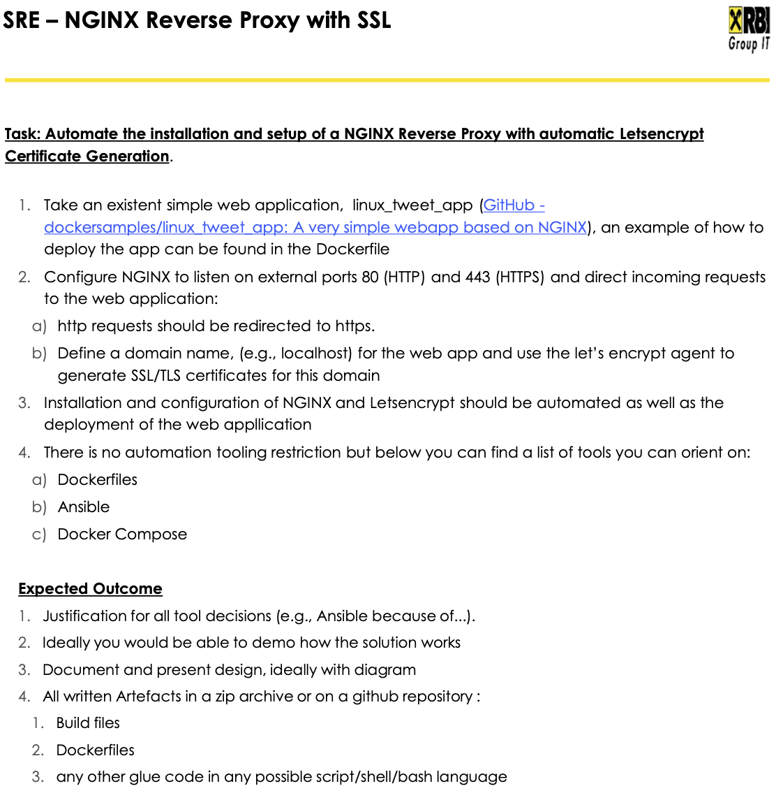

# NGINX Reverse Proxy with SSL

## Task description



## Preconditions

### Toolstack

- ansible
- docker
- docker-compose

### Ansible

- `amazon.aws` collection:
    ```bash
    ansible-galaxy collection install amazon.aws
    ```
- `community.general` collection:
    ```bash
    ansible-galaxy collection install community.general
    ```

#### Known Issues

##### objc[79826]: +[__NSCFConstantString initialize]
Reference: https://github.com/ansible/ansible/issues/76322

_Error_:
```bash
objc[79826]: +[__NSCFConstantString initialize] may have been in progress in another thread when fork() was called.
objc[79826]: +[__NSCFConstantString initialize] may have been in progress in another thread when fork() was called. We cannot safely call it or ignore it in the fork() child process. Crashing instead. Set a breakpoint on objc_initializeAfterForkError to debug.
ERROR! A worker was found in a dead state
```
_Solution_:
```
export OBJC_DISABLE_INITIALIZE_FORK_SAFETY=YES
```

### AWS
- AWS Accoount: `723952339148`
- VPC:
    ```bash
    aws ec2 describe-vpcs --query Vpcs[0].VpcId --output text
    vpc-064c3eb0153d40a17
    ```
- Subnets:
    ```bash
    aws ec2 describe-subnets --query 'Subnets[].{"SubnetId": SubnetId, "CidrBlock": CidrBlock}'
    ```

    ```json
    [
        {
            "SubnetId": "subnet-00c70ef9b77b58b14",
            "CidrBlock": "172.31.32.0/20"
        },
        {
            "SubnetId": "subnet-0a97dbc8b332ad55c",
            "CidrBlock": "172.31.0.0/20"
        },
        {
            "SubnetId": "subnet-047b0723bbc77a18d",
            "CidrBlock": "172.31.16.0/20"
        }
    ]
    ```
- Github Token in AWS Secretsmanager:
    ```bash
    aws secretsmanager create-secret --name github-token --secret-string "github_pat_*****"
    ```

    ```bash
    aws secretsmanager list-secrets --query SecretList[].Name
    [
        "github-token"
    ]
    ```
#### Steps

##### Install AWS CLI

```bash
curl "https://awscli.amazonaws.com/AWSCLIV2.pkg" -o "AWSCLIV2.pkg"
sudo installer -pkg AWSCLIV2.pkg -target /
```

##### Provision EC2 instance

The following resources are required:

- Security Group
- Private Subnet
- Elastic IP (required for public access)

Used tool: **Terraform**

> [!NOTE]
> Folder structure
> ```bash
> terraform
> └── ec2
>    ├── config.tf
>    ├── ec2-key-ansible.pem
>    ├── ec2-key-webserver.pem
>    ├── ec2-webserver-keypair.tf
>    ├── ec2-webserver.tf
>    ├── elastic-ip.tf
>    ├── main.tf
>    ├── outputs.tf
>    ├── plan.out
>    ├── security_group_webserver.tf
>    ├── terraform.tfstate
>    ├── terraform.tfstate.backup
>    └── userdata
>        └── webserver-userdata.sh
>
> 3 directories, 13 files
>```

##### Get EC2 Private Key from AWS Secretsmanager

```bash
aws secretsmanager get-secret-value --secret-id ec2-private-key --query SecretString --output text > ec2-key.pem && chmod 600 ec2-key.pem
```

#### Get EC2 Instance details

```bash
aws ec2 describe-instances --query 'Reservations[].Instances[?State.Name==`running`].{"InstanceId": InstanceId,PublicDnsName: PublicDnsName,PublicIpAddress: PublicIpAddress}'
```

```json
[
    {
        "InstanceId": "i-083bbc000527fa9b5",
        "PublicDnsName": "ec2-63-178-42-193.eu-central-1.compute.amazonaws.com",
        "PublicIpAddress": "63.178.42.193"
    }
]
```

#### Connect to EC2 Instance

##### SSH

tbd

##### AWS CLI

```bash
aws ec2-instance-connect ssh --instance-id i-083bbc000527fa9b5 --private-key-file ec2-key.pem
```

#### Delete EC2 instance and infrastructure

```bash
terraform plan -destroy -out=plan.out
terraform apply
for secret in ec2-private-key ec2-public-key ; do aws secretsmanager delete-secret --force-delete-without-recovery --secret-id $secret ; done
```

> [!NOTE]
> The permanent deletion of secrets in AWS Secretsmanager can take several minutes!
 
## Ansible Playbook
    
> [!NOTE]
> Folder strucutre:
> ```bash
> ansible
> ├── inventories
> │   └── demo
> │       └── hosts
> ├── main.yaml
> └── roles
>     ├── build
>     │   └── tasks
>     │       └── main.yaml
>     ├── certbot
>     │   ├── defaults
>     │   │   └── main.yaml
>     │   └── tasks
>     │       └── main.yaml
>     ├── certbot_check_only
>     │   ├── defaults
>     │   │   └── main.yaml
>     │   └── tasks
>     │       └── main.yaml
>     ├── compose
>     │   └── tasks
>     │       └── main.yaml
>     ├── get_private_key_from_aws_secretsmanager
>     │   ├── defaults
>     │   │   └── main.yaml
>     │   └── tasks
>     │       └── main.yaml
>     └── nginx
>         ├── defaults
>         │   └── main.yaml
>         └── tasks
>             └── main.yaml
> 
> 20 directories, 12 files

### Build only

Builds only the the required image.

```bash
ansible-playbook -i inventories/demo -u ansible build.yaml --extra-vars='{"repository": "dockersamples/linux_tweet_app", "branch": "master", "image_name": "localhost/webapp", "image_tag": "1.0", "tag_image_latest": true}'
```

### Deployment only

defaults:
- desired_state:  
  - running (default)
  - stopped

Deploys and starts the application and NGINX as a reverse-proxy. Additionally, certbot runs to issue or renew the SSL certificate.

> [!NOTE]
> Due to the reason, that the deployment process is designed specifically for the webapp ausing a reverse-proxy, some variables such as `domain_name` and `email` have been definded within the Ansible playbook. However, in case required, the variables can be overwritten in the `extra-vars`. Also, this variables specifically are shared with multiple roles. So `defaults` per role has not been implemented for the time being.
> 
- desired_state: "running":
    ```bash
    ansible-playbook -i inventories/demo -u ansible deploy-webapp.yaml --extra-vars='{"image_name": "localhost/webapp", "image_tag": "1.0"}'
    ```
    ```bash
    ansible-playbook -i inventories/demo -u ansible deploy-webapp.yaml --extra-vars='{"image_name": "localhost/webapp", "image_tag": "1.0", "desired_state": "running"}'
    ```
- desired_state: "stopped":
    ```bash
    ansible-playbook -i inventories/demo -u ansible deploy-webapp.yaml --extra-vars='{"image_name": "localhost/webapp", "image_tag": "1.0", "desired_state": "stopped"}'
    ```